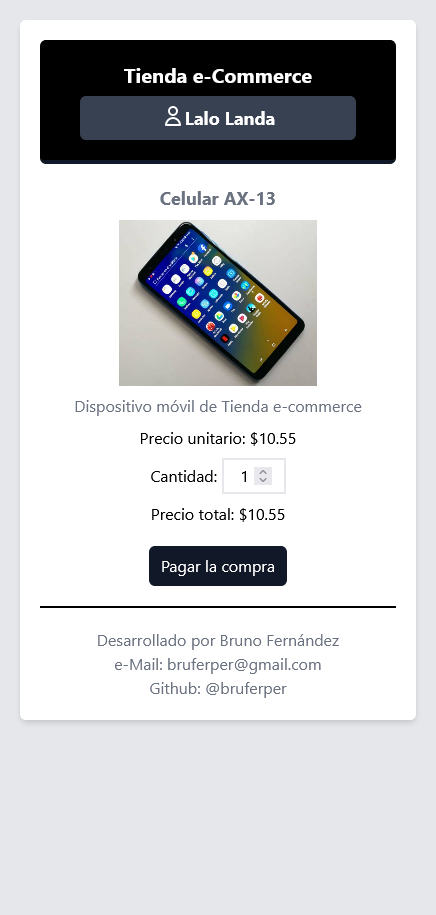
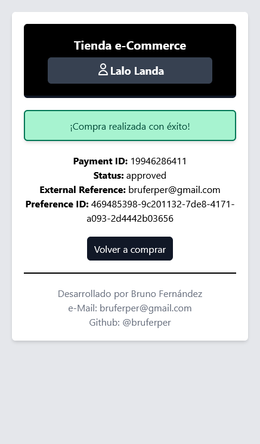
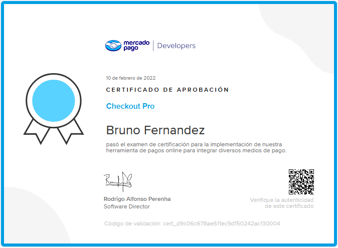

# MercadoPago Certificate Developer

Hi! 👋

This is the project that I create to get the MercadoPago certification to be an accredited developer.

I built it from scratch using these technologies:

Backend: 
- Java 11
- Spring Boot 2.5
- Heroku hosting

Frontend:
- Angular 12
- Tailwind CSS
- Firebase hosting

The application is available here: https://mercadopago-dev.web.app

Some screenshots:

You can find useful resources here:
- https://www.mercadopago.com.uy/developers/es/guides
- https://www.mercadopago.com.uy/developers/es/reference

Get certified!

If you have questions about this certification or code, please let me know and I will be happy to assist you.

*Please, take this code only as reference. Write your own code to practice and rock!* 🔥

